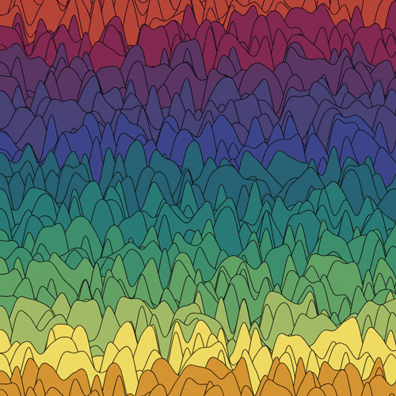

# Hail and well met, friend!
## I'm a software engineer @ [Setpoint](https://setpoint.io) and a collector of too many guitar pedals.

_Pardon us for living, but the graveyard is full._ - The Fleshtones

